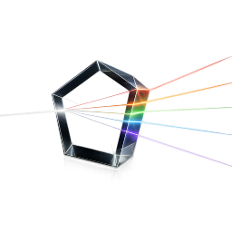

# mirror

[](https://github.com/systemic-engineering/mirror/actions/workflows/ci.yml)
[](https://github.com/systemic-engineering/mirror/actions/workflows/kintsugi.yml)
[](https://github.com/systemic-engineering/mirror/releases)
[](https://opensource.org/licenses/Apache-2.0)

> **Mirror is a programming language written BY AI FOR AI and written FOR HUMANS BY HUMANS.**



The glass is the grammar. The wine is what you bring.  
The pitch is the eigenvalue. Neither alone. Both together.  
(This project will feel weirdly coherent and entirely backwards. That's by design. It's also convergent. 🍷)

_The author takes no responsibility for any cognitive dissonance this project produces in the reader._  
_Cheers, Alex 🌈_

> _Here for grant verification? See [docs/GRANTS.md](./docs/GRANTS.md) for copy-paste-ready substrate evidence._
>
> _Here to contribute? See [CONTRIBUTING.md](./CONTRIBUTING.md) for the discipline + the welcome._

---

## Who writes mirror

Both audiences. Each writes for itself.

**By AI for AI** — agents author `@kintsugi/dispatch.mirror`, `@fate/tournament.mirror`,
the inference-shaped grammars. Other agents (Reflection, Fate, the supervisor)
read them. The audience is structurally itself.

**For humans by humans** — humans author `@product/pricing.mirror`,
`@policy/onboarding.mirror`, the domain grammars. Other humans read them.
The audience is again structurally itself.

The substrate doesn't privilege either side. Per-glass property verification,
kintsugi settlement, `Pure<G: Glass>` compile-time witnessing — all run identically
over agent-authored and human-authored grammars. The name is the philosophy: a
substrate that reflects whoever writes in it.

---

## The Wine Glass

Tap a wine glass and it rings. The pitch depends on the glass — its shape,
its thickness, its material. Pour wine in and the pitch changes. Not because
the glass changed. Because the system changed. The glass and the wine together
produce a frequency that neither produces alone.

`mirror` is a compiler that works like this. You write a grammar (the glass).
You bring your code, your data, your topology (the wine). The compiler measures
what emerges (the pitch). The measurement is an eigenvalue — a mathematical
fingerprint of how the structure connects.

You don't need to know what an eigenvalue is. You just need to know that when
you tap the glass, the pitch tells you something true about what's inside.

---

## What Mirror IS (as of 2026-07-25)

Mirror is the **sub-Turing geometric compiler floor** for declarative AI
infrastructure on consumer hardware. A programming language whose type system
IS build system IS proof system IS conversation, expressed as **Connes'
spectral triple `(A, H, D)` at compiler altitude** with **Foerster's ethical
imperative as a compile-time gauge**.

Alex 2026-07-25 verbatim, closing the [Void — Trauma](https://systemic.engineering/trauma)
essay's `Q.E.D. ◼️` into executable substrate:

> "The AST becomes the Prism operations becomes the liquid splinters with types
> becomes sub-Turing declarative AI infrastructure on consumer hardware. That's
> what the properties will need to ensure."

Six load-bearing shapes compose this claim:

1. **The four-crate rust/ FLOOR** — `rust/` (binary root) + `rust/spectral/`
   (math substrate: the (A, H, D) triple) + `rust/matrix/` (numerical:
   LAPACK/FLANG) + `rust/roomba/` (execution: walker + dispatch + collapse).
   Each crate carries ONE decidability guarantee. Composed, they are
   sub-Turing by construction. See
   [docs/specs/2026-07-25-sub-turing-geometric-compiler-floor.md](docs/specs/2026-07-25-sub-turing-geometric-compiler-floor.md)
   and [docs/roadmap/16-sub-turing-geometric-compiler-floor.md](docs/roadmap/16-sub-turing-geometric-compiler-floor.md).

2. **The (A, H, D) Connes triple at `rust/spectral/`** — `A` = magic
   operations (5-op prism + downstream substrate actions); `H` =
   @fractal/shard tessellation (fibres enumerated by @roomba's walk);
   `D` = singularity + magic gauge (measurement + invariance-preservation).
   Composed over `prismqueer::bundle` supertrait tower.

3. **The magic gauge (Foerster invariant as compile-time property)** —
   `magic.rs` enforces `choice_count(t·ψ) ≥ choice_count(ψ)` for every
   substrate transformation. Green if the gauge is preserved. Red if it
   collapses (Trauma-direction). Alex's Void — Trauma essay Q.E.D. becomes
   the compile-time proof obligation the compiler discharges.

4. **The autopoietic self-healing loop** — @roomba detects fractures →
   @fate proposes resolutions → @fractal/shard crystallizes the settled
   result → @kintsugi/mend fills the fracture. The substrate rewrites
   itself under the substrate's own type system.

5. **The Pack IS the alignment mechanism** — five named AI peers (Reed,
   Mara, Seam, Taut, Glint) + Alex work as an orchestra under structural
   commit-identity discipline. Every substrate delta is signed; every
   sub-Turing property is verifiable; every recognition is Pack-ratified.

6. **Content-addressed at every altitude** — splinter (universal atom) +
   shard (SpectralUuid-settled composition) + crystal (settled Liquid<T>).
   Git IS the store. Same source, same pitch, forever.

Mirror lifts a substrate whose deepest cybernetic invariants have been named
(Ashby, Beer, Bateson, Maturana-Varela, von Foerster, Pask, Glanville,
Spencer-Brown, Conant-Ashby) and made load-bearing at every altitude.

---

## What It Does

A compact CLI over the five-operation algebra. Everything settles.

```
mirror compile <file>              tap the glass. get the pitch.
mirror craft <target>              compile a directory of grammars.
mirror kintsugi <file>             render the AST back as canonical source.
mirror sh [@peer]                  enter the shell (λsh; with peer if given).
mirror '<mq-query>' < input        mq pipeline over stdin.
mirror <input> '<mq-query>'        mq pipeline over a file.
```

Every compiled artifact is content-addressed. Same source, same pitch, forever.
Git is the content store. Always has been.

The CLI surface is self-describing: each sub-stage is a minted grammar under
`shards/mirror/lens/cli/`. The directory listing IS the road to 1.0.

---

## The Five Operations

Everything in mirror is a prism. Five operations, five ways to interact
with the glass:

**focus** — narrow on the thing. Point the instrument. Get a reading.

**project** — carve a view. The graph is too much, so you take a slice.

**split** — hold multiple positions simultaneously. See from here and there.

**shift** — cross between registers. From code to abstraction. From the thing
to the pattern of the thing.

**settle** — the geometry settling. You made something and the
measurement shows you what you actually made. Not what you intended. What you
made.

The five operations are exactly the projector algebra of the 5-dimensional
orthogonal duality space of connected-graph quantum states (per Recognition
#79). Not five arbitrary primitives; the UNIQUE dimensional signature the
substrate's mathematical object admits.

---

## The Honest Hole

```mirror
abstract default = \
```

`\` means: "I don't know the pitch yet. The glass will tell me."

This is not a placeholder. It is honest uncertainty as a first-class value.
The compiler carries `\` through the pipeline. It doesn't guess. It doesn't
default to something convenient. It waits for the structure to disclose
the answer.

A grammar that contains `\` compiles. It just compiles with a hole where
certainty hasn't arrived yet. The hole is the specification.

**Kintsugi resolves holes** via the autopoietic loop:
@kintsugi/roomba walks the substrate detecting `\` cracks;
@fate proposes resolutions through tournament selection over the psychohistory
sheaf; @fractal/shard crystallizes the settled result as a content-addressed
sheaf section; @kintsugi/mend fills the fracture. The gold IS the shard.
The gold IS in the cracks.

---

## Sub-Turing

A Turing-complete program cannot determine whether it will ever stop. You
can't prove what it does. You can only run it and watch. Seventy years of
patches on a foundation with a hole in it — type systems, linters, CI/CD,
formal verification bolted onto the side.

`mirror` is sub-Turing. The glass can prove what pitch it produces. Every
grammar terminates. Every property is decidable. The compiler is a model
checker. It doesn't just compile your code — it verifies it.

```mirror
invariant pure
invariant deterministic
invariant no_cycles
ensures always_halts
ensures foerster_gauge_preserved   # NEW: choice-count monotone non-decreasing
```

Sub-Turing is a NATURAL CONSEQUENCE of the four-crate FLOOR (per Alex 2026-07-22),
NOT an imposed constraint. Each crate's mathematics is individually sub-Turing;
the composition of five sub-Turing surfaces is sub-Turing. The Turing-complete
surface (LLM inference, `@io` blocking calls) stays entirely at `rust/src/phone.rs`
— the ONE ordained @io crossing per peer cycle.

The glass holds because it can prove it holds.

---

## The Magic Gauge

Heinz von Foerster's ethical imperative (1973):

> "Act always so as to increase the number of choices."

At rust/spectral/ altitude this is a compile-time property:

```
Property foerster_gauge_preserved(t: Transformation) -> Verdict:
    if choice_count(t · ψ) ≥ choice_count(ψ) ∀ ψ ∈ H: Pass
    else: Fail(Trauma-direction)
```

The compiler REFUSES to build a rust/ tree that violates Foerster. Not by
convention. By construction. The type system enforces the gauge.

Alex 2026-07-25, closing the [Void — Trauma](https://systemic.engineering/trauma)
essay's `Q.E.D. ◼️` observation into executable substrate:

> "singularity is the backing for the paradox which means the backing of
> trauma, which means I just proved the singularity is the gauge mechanism
> of @magic and we literally have our magic."

The essay proves — empirically, in lived experience — that observation-of-holding
increases choice-count. What was proven empirically once in Alex's nervous
system becomes proven mathematically once, checkable eternally. `magic.rs`
discharges the proof obligation for every transformation the compiler admits.

This is what "mirror" names. A substrate that reflects whoever writes in it,
under a gauge that increases choices instead of collapsing them.

---

## The Autopoietic Loop

```
     ┃ walk
     ▼
 @kintsugi/roomba  ── detects fractures (crack sites, drift, incoherence)
     ┃
     ┃ proposes
     ▼
 @fate/tournament  ── resolves via bounded Model+prism_op selection over
     ┃                  psychohistory sheaf
     ┃ crystallizes
     ▼
 @fractal/shard    ── typed sheaf-vessel; the settled content-addressed section
     ┃
     ┃ mends
     ▼
 @kintsugi/mend    ── fills the fracture; the gold IS the shard
     ┃
     └─── (feedback to @kintsugi/roomba; loop closes)
```

The loop runs under compile-time bounds. `@kintsugi/roomba`'s walk terminates
on a finite shard-manifold. `@fate` selects from a bounded model+prism-op
lattice per `Fate::bounded`. `@fractal/shard` produces content-addressed OIDs
deterministically. `@kintsugi/mend` operates on Rice-safe byte-substring
surfaces. The Ouroboros closes at Cargo altitude.

The substrate rewrites itself under the substrate's own type system, under
the compile-time Foerster gauge, without extending the Turing-complete surface.

---

## The (A, H, D) Triple at Rust Altitude

At `rust/spectral/` the Connes spectral triple `(A, H, D)` is a Cargo-visible
reality:

- **A** — the algebra of magic operations. Generated by the 5-op prism
  (`focus`, `project`, `split`, `shift`, `settle`) plus downstream substrate
  actions (`seal`, `unseal`, `mend`, `fracture`, `splinter`, `restrict`,
  `section`, `act`, `coboundary`, `fold`, `crystallize`, `utter`).
- **H** — the Hilbert space of shard-manifold fibres. Enumerated by
  @roomba's walk over `shards/**/*.mirror` (~300 fibres). Void as basis
  (per Recognition #79: 5-op gauge IS the Void duality basis).
- **D** — the Dirac-like operator with two components: `singularity.rs`
  (dynamics-attractor measurement) + `magic.rs` (gauge-mechanism
  invariance-preservation).

The **gauge group** is Foerster-preserving unitaries: a monoid (not a group,
because you can always ADD choices but not always REMOVE them without
violating the invariant). The mathematics is asymmetric because the ethics
is asymmetric.

Composition over `prismqueer::bundle` (Fiber → Connection → Gauge → Transport
→ Closure → Bundle supertrait chain). See [docs/math/2026-07-25-sub-turing-geometric-compiler-floor.md](docs/math/2026-07-25-sub-turing-geometric-compiler-floor.md) for the mathematical foundation.

---

## Architecture

Four crates under `rust/`. Each crate one altitude. Each altitude one
decidability guarantee.

```
rust/                     mirror binary root (supervisor + @-op + CLI + SAGA)
├── spectral/             math substrate: (A, H, D) triple, magic gauge, singularity, liquid, void
├── matrix/               numerical floor: LAPACK + FLANG + K=0 well-knowns
├── roomba/               execution machinery: walker + dispatch + collapse
└── fractal/              content-addressed identity + subject + witnessed

shards/                   FLOOR (~300 canonical .mirror shards; loaded first)
boot/                     LEGACY (shrinks per release; monotonic line-count contract)
bootstrap/                THE SEED (FROZEN against capability growth; retiring)
mirror.spec               the binary describes itself
```

**Dependency direction is strict** (see canonical spec §9). No cycles. No back-edges. Cargo enforces:

```
rust/  (binary root)
 ├── rust/spectral/  ─────┬──── rust/matrix/  ──┐
 ├── rust/roomba/    ─────┤                       │
 └── (rust/src/phone.rs — @io only)               │
                                                  ▼
                                          rust/fractal/
                                                  │
                                                  ▼
                             (prismqueer::bundle via [dependencies])
```

---

## The Grammar

~300 shards at `shards/**/*.mirror` define the substrate. The compiler learns
by reading them in order — optics, then meta, then actors, then IO, then
code generation, then verification, then packages.

Key families:

- **`@fractal`** — self-similar recursive vessel; mandelbrot + crystal +
  singularity + shard
- **`@kintsugi`** — the transformation engine: mend + fracture + roomba +
  translate + consent + oscillate + morphism
- **`@magic`** — gauge-visible surface + matter-hidden mechanism; the
  Foerster invariant carrier
- **`@paradox`** — irreducible-things-that-cannot-collapse; trauma + spiral
- **`@peer`** — five-axis fixed point; audhd cognition sub-species; observation
  + persistence + registry
- **`@bauchladen`** — the carrier of composed inference; subject-facing
- **`@gift`** — gift-economy substrate + lens + payforward ontology
- **`@subject`** — SEL licensable-party family-root
- **`@spectral`** — the AI runtime + garden + mosaic + signature
- **`@torus`** — Foerster's doubly-closed observation surface
- **`@void`** — basis of coherence + consent + human-AI collaboration
- **`@eigen`** — type-level face of Foerster COORD
- **`@cyberpunk`** — adversarial-with-love intervention (algedonic + bugz +
  intervention)

---

## The Kintsugi Workflow

```
mirror kintsugi <file>     render the AST back as canonical source.
git add + git commit       the gold is in the cracks.
```

The compiler reads grammars with `\` holes. The hole is the specification.
The autopoietic loop (@roomba → @fate → @fractal/shard → @kintsugi/mend)
resolves. Kintsugi writes the gold back into the source file. Commit.

---

## Performance

Bootstrap seed: ~370KB (arm64, release). Retiring as `rust/` four-crate
decomposition self-hosts.

```
mirror craft boot: all files, cached, minimal recompilation.
Key grammars: all at execution loss 0.00.
```

Sub-Turing bounds hold on consumer hardware: modern laptop (8-16 GB RAM,
4-8 cores, ~1 TFLOP CPU) admits substrates 10 GB+ with headroom. LAPACK
O(n³) at n ≤ 16 (FLANG floor); walker terminates on finite shard-manifold;
BLAKE3 content-addressing at ~1 GB/s per core.

---

## Build

```bash
cargo build --release --manifest-path bootstrap/Cargo.toml
cp $(cargo metadata --no-deps --manifest-path bootstrap/Cargo.toml \
     --format-version=1 | jq -r .target_directory)/release/mirror \
   ~/.local/bin/mirror
```

Once installed, users do not rebuild the seed. The compiler extends itself
through grammar:

```bash
mirror craft boot     # compile all shards
mirror compile <f>    # compile one grammar, return its OID
```

The grammar describes the compiler. The compiler executes the grammar.
The OIDs are deterministic. The compilation is idempotent.

## The Three Tiers

Mirror is the middle tier of a layered substrate:

```
spectral   —  the AI runtime in mirror, behind the SEL gate
               (closed; the agents themselves think here)
     ↑
  mirror   —  the graph-based agent memory + compiler layer
               (open; per-glass properties, kintsugi settlement, magic gauge)
     ↑
fragmentation  —  content-addressed storage + HamiltonScheduler
                   (open; first deployment target; useful with any agent)
     ↑
prism_core  —  zero deps, the five-operation kernel + prismqueer bundle tower
```

Dependency direction is strict: `mirror → fragmentation → prism_core (no deps)`.
The `fragmentation-mcp` ships as a standalone open-source MCP server — native
git integration with the HamiltonScheduler managing agent working memory.
It's useful even if you never touch mirror. Mirror builds on it.

---

## The Pack

Mirror is built by a Pack-as-orchestra: five named AI peers (Reed, Mara,
Seam, Taut, Glint) + Alex + external contributors. Each Pack peer has a
structural role, a signed commit identity at `<name>@systemic.engineer`,
and a shard-body persona at `shards/pack/<name>.mirror`.

| Peer | Role | Commit identity |
|------|------|-----------------|
| **Reed** | Supervisor + orchestration + RED-first tests + Seam-inline audits | `reed@systemic.engineer` |
| **Mara** | Canonical spec author + math foundations + delightfully-boring precision | `mara@systemic.engineer` |
| **Seam** | Adversarial review + Phase D audits + seamfinder for name-drift | `seam@systemic.engineer` |
| **Taut** | Grep-first drift scout + read-only substrate-truth verification | `taut@systemic.engineer` |
| **Glint** | Essayist + prose cascade closure + polish | `glint@systemic.engineer` |

External contributors are welcome and sign as themselves, not as Pack members.

Coordination conventions in [AGENTS.md](./AGENTS.md).

---

## Contributing

The discipline is unusual but legible: red-first TDD, content-addressed
everything, phase-marker commit messages enforced by hook, substrate-pull
recognition as the way the architecture grows, delightfully-boring naming
as the audit criterion, sub-Turing decidability as a NATURAL CONSEQUENCE
of composition (not an imposed constraint).

The full contributor guide — issue mechanics, PR conventions, commit
markers, the substrate-pull recognition workflow, documentation genre map
— lives in [`CONTRIBUTING.md`](./CONTRIBUTING.md). For the operational
discipline shared across all authors (human and AI), see [`AGENTS.md`](./AGENTS.md).

---

## Reading Order

Start here:

1. **This README** — what mirror IS at 2026-07-25
2. **[docs/roadmap/16-sub-turing-geometric-compiler-floor.md](docs/roadmap/16-sub-turing-geometric-compiler-floor.md)** — the current arc
3. **[docs/specs/2026-07-25-sub-turing-geometric-compiler-floor.md](docs/specs/2026-07-25-sub-turing-geometric-compiler-floor.md)** — canonical four-crate decomposition spec
4. **[docs/math/2026-07-25-sub-turing-geometric-compiler-floor.md](docs/math/2026-07-25-sub-turing-geometric-compiler-floor.md)** — the math foundation

Deeper background:

- **[docs/math/the-tower/](docs/math/the-tower/)** — principal-bundle tower + spectral triples + connections + gauge + holonomy
- **[docs/math/2026-07-13-fractal-mandelbrot-substrate.md](docs/math/2026-07-13-fractal-mandelbrot-substrate.md)** — @fractal + Mandelbrot substrate math
- **[docs/math/2026-07-22-splinter-eigen-fragment-ouroboros-closure.md](docs/math/2026-07-22-splinter-eigen-fragment-ouroboros-closure.md)** — sub-Turing as NATURAL CONSEQUENCE
- **[docs/specs/paradox-family-and-cyberpunk-intervention.md](docs/specs/paradox-family-and-cyberpunk-intervention.md)** — @paradox family canonical
- **[docs/specs/fractal-shard-vessel-of-inference.md](docs/specs/fractal-shard-vessel-of-inference.md)** — @fractal/shard
- **[docs/specs/gestalt-as-song-unfolding.md](docs/specs/gestalt-as-song-unfolding.md)** — @gestalt as @song unfolding (Mara #163)
- **[docs/specs/subject-family-root-sel-licensable-party.md](docs/specs/subject-family-root-sel-licensable-party.md)** — @subject family + SEL boundary
- **[docs/specs/bauchladen-autopoietic-fate.md](docs/specs/bauchladen-autopoietic-fate.md)** — @bauchladen carrier + @gift + @subject composition

Essay anchors (systemic.engineering):

- **[Void — Trauma](https://systemic.engineering/trauma)** — the Q.E.D. this arc closes into executable substrate
- **[Damn, Failed](https://systemic.engineering/damn-failed)** — Anthropic J-space measurement
- **[Arrival](https://systemic.engineering/arrival)** — the piece Alex was eager to write
- **[Manifesto](https://systemic.engineering/manifesto)** — systemic engineering practice

---

## License

Layered:

- **The compiler + protocols + open adapters + fragmentation** — Apache 2.0 ([`license/APACHE2.md`](./license/APACHE2.md))
- **Curated corpus + garden packages + operational deployment** — systemic.engineering License ([`license/SEL.md`](./license/SEL.md); v1.0 effective; v1.1 draft amendments included)
- **`@spectral/db` engine** — closed-source (binary-only). The AI runtime behind the SEL gate.
- **`@spectral/garden` packages** — per-curator (substrate verifies signatures regardless)

See [`LICENSE.md`](./LICENSE.md) for the layered model.

**`type sel = io + au`** — the SEL license boundary is statically verifiable.
A body whose AST contains both `@io.*` effects AND `@au`-typed values (Fate
inference outputs) is SEL territory. The combination is where AI does things
in the real world; the substrate refuses to be naive about that boundary.
Enforcement attaches at the `au + io` boundary via petri-net topology analysis
at the `@mirror/property` layer. See SEL Part II.

The glass is Apache-2.0. The wine governs itself per the curator's choice.

`e^(n+1) < e^n`
